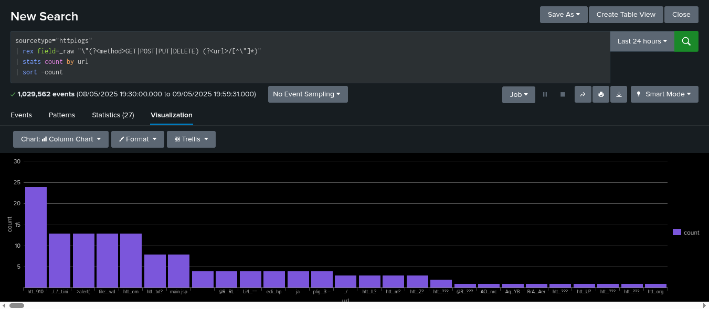

# Splunk Log Analysis Project

This project demonstrates how to use Splunk to analyze and visualize system log data using the free 60-day trial.

## 📂 Logs Used
- `dhcp.log` link- https://www.secrepo.com/maccdc2012/dhcp.log.gz
- `dns.log` link- https://www.secrepo.com/maccdc2012/dns.log.gz
- `http.log` link- https://www.secrepo.com/maccdc2012/http.log.gz

## 🔍 What I Did
- Uploaded and indexed log files with custom sourcetypes
- Used SPL commands: `table`, `top`, `dedup`, `stats`, `where`, etc.
- Created a Splunk dashboard to visualize important data
- Performed custom field extraction using the UI
- Identified patterns from log data using `status`, `ip`, and `time`

## 📊 Screenshots

## 🛠 Skills Used
- Splunk Core (Free Trial)
- Field Extraction & Data Indexing
- Log Management & Analysis
- Dashboard Creation

## 🎯 Goal
To explore how machine log data can be transformed into valuable insights using Splunk's powerful search and visualization tools.

## 📌 Note
This is a beginner-level project meant to demonstrate basic log ingestion, search, and dashboarding capabilities in Splunk.
